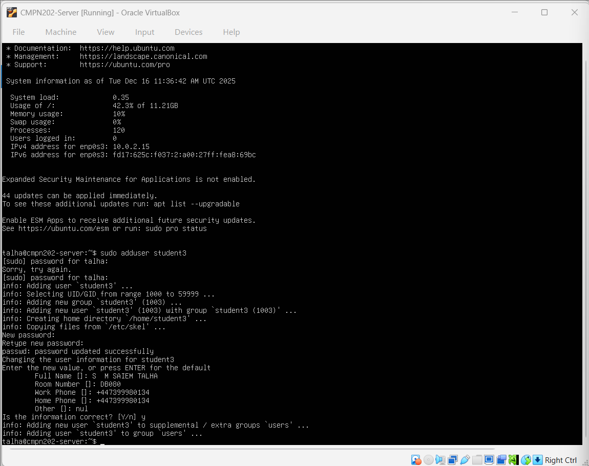

# 🛡️ Week 5 – User Management & Access Control

---

## 1. Introduction
Week 5 focused on **user and group management** in Linux, which is a core aspect of system security and administration.  
Instead of relying on a single user, proper access control was implemented by creating users, managing groups, and assigning permissions carefully.

This week demonstrates how Linux enforces security through **user isolation and controlled privilege escalation**.

---

## 2. Objectives for This Week
The main objectives of Week 5 were:

- Create additional user accounts
- Understand Linux user and group structure
- Assign users to groups
- Manage permissions using group membership
- Apply the principle of least privilege

---

## 3. User Account Creation

A new user account (`student3`) was created to avoid using the root account for regular tasks.

### Command Used
- `sudo adduser student3`

This confirms that the user was successfully created with a home directory and default settings.

---

## 4. Understanding User Groups

After creating the user, group membership was checked to understand default permissions.

### Command Used
- `groups student3`

This shows that the user initially belongs only to its own group and the `users` group.

---

## 5. Creating a Custom Group

To organise permissions properly, a new group named `cmpn202` was created.

### Command Used
- `sudo groupadd cmpn202`

Creating custom groups allows administrators to control access without modifying individual user permissions repeatedly.

---

## 6. Assigning User to Group

The user was added to the newly created group using group modification commands.

### Command Used
- `sudo usermod -aG cmpn202 student3`

This ensures that `student3` inherits permissions associated with the `cmpn202` group.

---

## 7. Verifying Group Membership

Group membership was verified to confirm successful assignment.

### Command Used
- `groups student3`

This confirms that the user now belongs to both the default groups and the `cmpn202` group.

---

## 8. Access Control Importance

Proper user and group management provides:

- Improved system security
- Clear separation of responsibilities
- Reduced risk of accidental system damage
- Easier permission management

Linux permissions combined with group-based access control form the backbone of secure system administration.

---

## 9. Week 5 Requirement Checklist

| Requirement | Status |
|------------|--------|
| New user created | ✅ Completed |
| Group structure reviewed | ✅ Completed |
| Custom group created | ✅ Completed |
| User added to group | ✅ Completed |
| Group membership verified | ✅ Completed |

---

## 10. Reflection
Week 5 demonstrated that security is strongly tied to **how users and permissions are managed**.  
By separating users, assigning roles via groups, and avoiding unnecessary privileges, the system becomes safer and easier to maintain.

This week reinforced real-world Linux administration practices used in enterprise environments.

---

### 🔗 Navigation
[Back to Index](INDEX.md) | [Week 1](Week1.md) | [Week 2](Week2.md) | [Week 3](Week3.md) | [Week 4](Week4.md) | [Week 6](Week6.md) | [Week 7](Week7.md)
