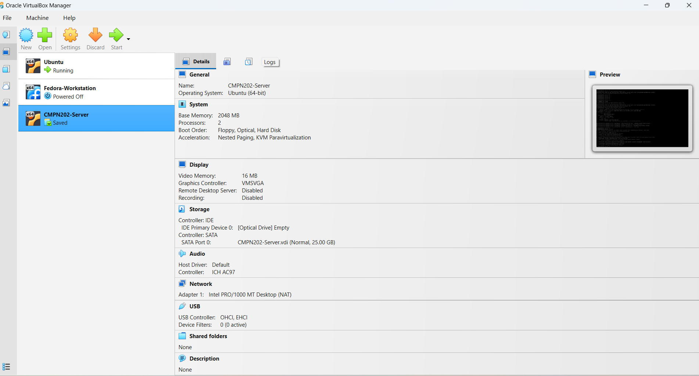
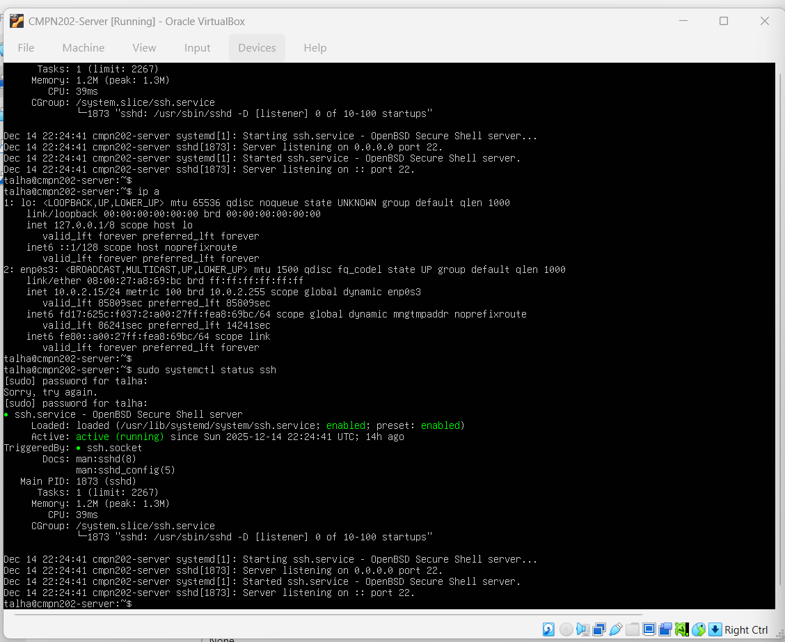

# Week 1 – System Planning & Distribution Selection

---

## Introduction

This week focused on planning the operating system environment required for the
Operating Systems coursework. The objective was to design a stable, secure, and
realistic Linux-based virtual environment that could support later tasks such as
remote administration, security hardening, monitoring, and performance evaluation.

A virtualised approach was chosen to allow safe experimentation without affecting
the host system, while also reflecting real-world client–server system design used
in professional server environments.

---

## System Architecture Overview

The planned system architecture consists of two main components:

- **Ubuntu Server (CLI-based)**  
  Acts as the primary server used for configuration, security implementation,
  monitoring, performance testing, and auditing. All administration is performed
  remotely using SSH.

- **Workstation (Host System)**  
  Used to remotely access and manage the server via Secure Shell (SSH).

This separation enforces command-line proficiency and mirrors real-world server
administration where servers are managed remotely rather than locally.

---

## System Planning Flow

The following structured planning steps were followed during system design:

1. Analyse coursework requirements  
2. Select virtualisation platform (Oracle VirtualBox)  
3. Choose an appropriate Linux server distribution  
4. Configure a minimal server installation (CLI only)  
5. Plan secure network connectivity  
6. Verify system readiness using command-line tools  

This methodical approach ensured the system was prepared for future configuration,
security hardening, and performance testing tasks.

---

## Distribution Selection Justification

### Selected Distribution: Ubuntu Server 24.04 LTS

Ubuntu Server 24.04 LTS was selected as the server operating system for the
following reasons:

- **Long-Term Support (LTS)**  
  Provides stability and regular security updates for up to five years, which is
  essential for secure server deployments.

- **Extensive documentation and community support**  
  Enables efficient troubleshooting and learning, particularly in an academic
  environment.

- **Wide package availability**  
  Required tools such as SSH, firewall utilities, monitoring tools, and security
  scanners are easily installed via APT.

- **Strong VirtualBox compatibility**  
  Ensures reliable operation within a virtualised environment without additional
  configuration overhead.

---

### Virtual Machine Creation

This screenshot shows the successful creation of the Ubuntu Server virtual
machine using Oracle VirtualBox, including allocated memory, CPU, and storage
configuration.

---

## Distribution Comparison Table

| Distribution | Stability | Documentation | VirtualBox Support | Decision |
|-------------|----------|---------------|--------------------|----------|
| Ubuntu Server 24.04 LTS | Very High | Excellent | Excellent | ✅ Selected |
| Debian | Very High | Moderate | Good | Not chosen |
| Fedora Server | Medium | Moderate | Good | Not chosen |
| CentOS Stream | High | Limited | Moderate | Not chosen |

Ubuntu Server was selected due to its balance between long-term stability, ease of
use, and suitability for both academic and real-world server environments.

---

## Virtual Machine Configuration

The Ubuntu Server virtual machine was configured using Oracle VirtualBox with the
following specifications:

| Component | Configuration |
|---------|--------------|
| Operating System | Ubuntu Server 24.04 LTS |
| Memory | 2 GB |
| CPU | 2 vCPUs |
| Storage | 25 GB (VDI) |
| Interface | Command Line (No GUI) |

### Headless Server Design Decision

A minimal, headless installation was intentionally chosen to reduce system
resource overhead and minimise the attack surface.  
By avoiding a graphical user interface, fewer background services are required,
which improves both **security** and **performance** and aligns with professional
server best practices.

---

## Network Configuration Planning

The server was configured using **NAT networking**.

This configuration was chosen because it:
- Allows internet access for software updates
- Provides a simple and secure default setup
- Reduces direct exposure of the server to external networks

### Network Design Trade-off

While NAT simplifies connectivity and improves security, it limits direct inbound
access. This trade-off is acceptable for this coursework because SSH access is
managed from the workstation and security takes priority over public accessibility.

---

## Initial System Verification

Basic system verification was performed using the command line to confirm that the
server was operational and ready for remote administration.

Key checks included:
- Verifying active network interfaces and IP address
- Confirming that the SSH service was installed and running

These checks ensured that the operating system was correctly installed and could
be securely accessed in later weeks.

---

### SSH Service Verification

This screenshot confirms that the SSH service is active and running on the
server, enabling secure remote administration without relying on the VirtualBox
console.

---

## Week 1 Requirement Checklist

| Requirement | Status |
|------------|--------|
| System architecture planning | ✅ Completed |
| Distribution selection and justification | ✅ Completed |
| Virtualisation platform selection | ✅ Completed |
| Network configuration planning | ✅ Completed |
| Initial system verification | ✅ Completed |
| Supporting evidence prepared | ✅ Completed |

---

## Reflection

This week demonstrated that careful system planning is critical before technical
implementation. Early decisions regarding operating system choice, architecture,
and network design directly impact system security, performance, and manageability.

Using a minimal Ubuntu Server environment reinforced key Linux administration
principles and provided a strong foundation for subsequent security hardening,
monitoring, and performance evaluation tasks.

---

### 🔗 Navigation
[Back to Index](INDEX.md) | Week 1 | [Week 2](Week2.md) | [Week 3](Week3.md) | [Week 4](Week4.md) | [Week 5](Week5.md) | [Week 6](Week6.md) | [Week 7](Week7.md)
