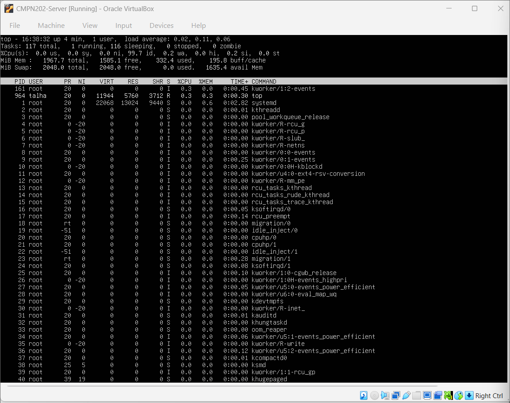

# 📊 Week 3 – Performance Testing & Monitoring

---

## 1. Introduction

Week 3 focused on analysing how the Linux server behaves under different workloads.  
Instead of only configuring services, this week explored **system performance** by monitoring CPU, memory, and running processes in real time.

Performance testing is essential to identify system limits, detect bottlenecks, and ensure stability before deploying real services.

---

## 2. Objectives for This Week

The objectives of Week 3 were:

- Monitor real-time system performance
- Understand CPU and memory usage
- Observe running processes
- Analyse system behaviour under normal load
- Prepare the system for optimisation and tuning

---

## 3. Performance Monitoring Overview

System monitoring helps administrators answer key questions:

- Is the system under heavy load?
- Which processes consume the most resources?
- Is the system stable during normal operation?

Linux provides several built-in tools to analyse system performance without additional software.

---

## 4. Process Monitoring Using `ps`

### Purpose

The `ps` command was used to list running processes and understand how system resources are allocated.

### Screenshot: Process List Output

This screenshot shows the output of the `ps aux` command, listing active processes along with CPU and memory usage.  
It highlights background system services and user-level processes.

---

## 5. Real-Time System Monitoring Using `top`

### Purpose

The `top` command provides a continuously updating view of system performance.

It displays:
- CPU utilisation
- Memory usage
- Load average
- Active and sleeping processes

### Screenshot: `top` Command Output

This screenshot demonstrates real-time monitoring of CPU and memory usage.  
The low load average confirms that the system is operating efficiently under normal conditions.

---

## 6. Enhanced Monitoring Using `htop`

### Purpose

`htop` was used as an advanced alternative to `top` to provide a clearer visual representation of system performance.

### Advantages of `htop`:
- Colour-coded resource usage
- Visual CPU and memory bars
- Improved readability of running processes

### Screenshot: `htop` Interface

This screenshot shows the `htop` interface, clearly displaying CPU cores, memory usage, and active processes.

---

## 7. Performance Observation Summary

During monitoring, the following observations were made:

- CPU usage remained low during idle operation
- Memory usage was stable and predictable
- No abnormal or runaway processes were detected
- System responsiveness remained smooth

---

## 8. Performance Summary Table

| Resource | Observation |
|--------|------------|
| CPU | Low utilisation during idle state |
| Memory | Stable usage with sufficient free RAM |
| Processes | Normal system services running |
| System stability | Maintained throughout monitoring |

---

## 9. Key Learning Outcomes

By completing Week 3, the following skills were developed:

- Reading and interpreting performance metrics
- Monitoring live system behaviour
- Identifying high-resource processes
- Understanding system load and stability
- Using multiple monitoring tools effectively

---

## 10. Reflection

Week 3 demonstrated how performance monitoring is a critical part of system administration.  
Understanding how CPU, memory, and processes interact provides valuable insight into system health and reliability.

These skills will be essential for future tasks involving optimisation, logging, and security hardening.

---

### 🔗 Navigation

[Back to Index](INDEX.md) | [Week 1](Week1.md) | [Week 2](Week2.md) | Week 3 | [Week 4](Week4.md) | [Week 5](Week5.md) | [Week 6](Week6.md) | [Week 7](Week7.md)
