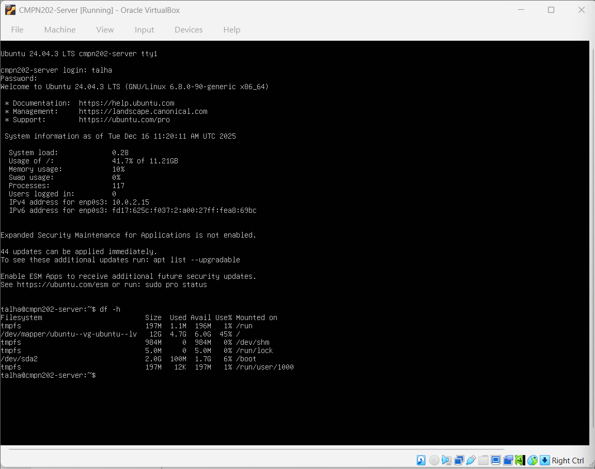
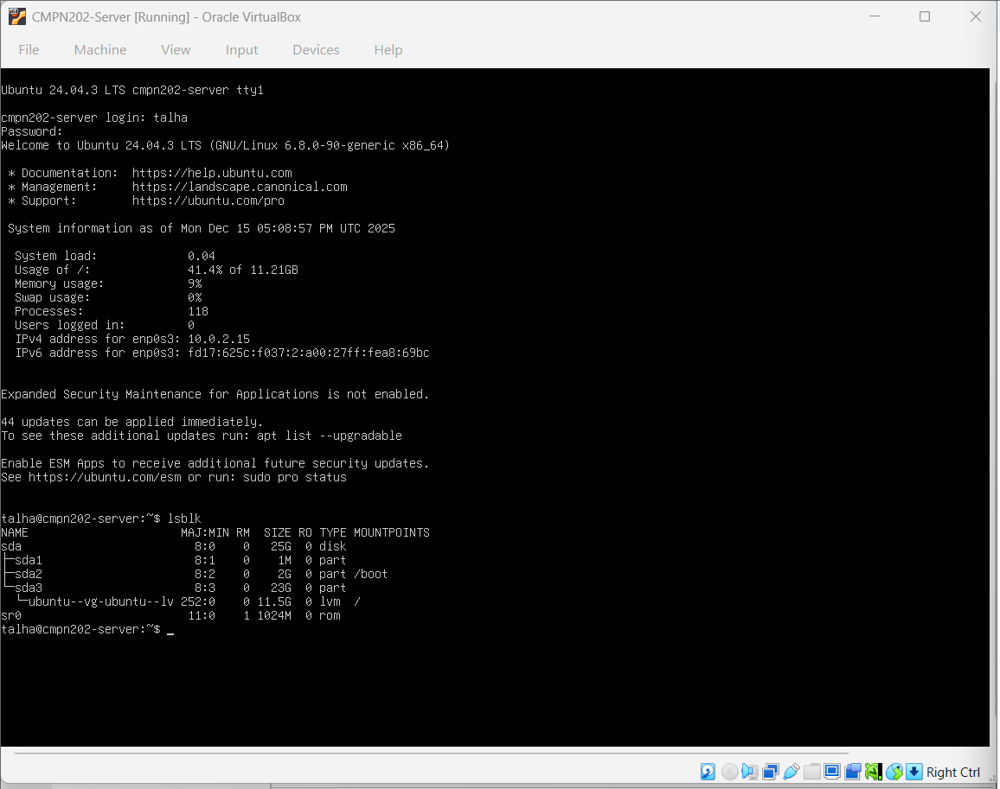

# 🔐 Week 4 – Network Services, SSH & Firewall Configuration

---

## 1. Introduction

Week 4 focused on implementing **network-level security controls** to protect the Ubuntu Server from unauthorised access.  
Unlike earlier weeks that focused on planning and monitoring, this week applied **active operating system security mechanisms** to restrict access and enforce administrative boundaries.

All system administration was performed **remotely via SSH from the workstation**, in line with the coursework administrative constraint.

---

## 2. Objectives for This Week

The objectives of Week 4 were:

- Review active network services and exposed ports
- Verify filesystem and disk stability before security changes
- Configure and enable a firewall using UFW
- Restrict network access to essential services only
- Enforce secure remote administration using SSH
- Verify system stability after security changes

---

## 3. Filesystem and Mount Point Analysis

Before applying firewall rules, the system’s mounted filesystems were reviewed to ensure system integrity and avoid misconfiguration.

This output confirms:
- Active mount points
- Filesystem types
- Read/write access modes

Understanding mounted filesystems ensures that security controls do not interfere with essential storage operations.

---

## 4. Disk Usage Verification

Disk usage was analysed to confirm sufficient free space and normal usage patterns before enabling security services.

This confirmed:
- Adequate available disk space
- Correct filesystem mounting
- No abnormal storage consumption

Stable disk usage reduces the risk of service disruption during firewall activation.

---

## 5. Network Services Review

A network service is any process listening for incoming connections.  
Reducing exposed services is a key operating system hardening strategy.

### Identified services:
- **SSH (port 22)** – required for remote administration
- No additional externally exposed services

Limiting exposed services reduces the attack surface and improves overall system security.

---

## 6. SSH and Remote Administration Security

Secure Shell (SSH) was used as the **sole method of server administration**.  
This reflects professional server environments where physical or console access is restricted.

SSH was chosen because it provides:
- Encrypted communication
- Strong authentication mechanisms
- Secure remote command execution

Further SSH hardening (key-based authentication and access restriction) is implemented and evidenced in later weeks.

---

## 7. Firewall Concept and Purpose

A firewall controls which network traffic is allowed or blocked at the operating system level.

The following principles were applied:
- **Default deny policy**
- **Least privilege**
- **Explicit service allowance**

UFW (Uncomplicated Firewall) was selected due to its simplicity, reliability, and tight integration with Ubuntu Server.

---

## 8. Firewall Configuration Using UFW

The firewall was configured using UFW to enforce strict access control.

### Commands used:
- `sudo ufw enable`
- `sudo ufw allow ssh`
- `sudo ufw status verbose`

This configuration ensures:
- The firewall is active
- SSH access is permitted for remote administration
- All other incoming connections are blocked by default

This significantly reduces exposure to unauthorised network traffic.

---

## 9. Before vs After Firewall Security Comparison

| Aspect | Before Firewall | After Firewall |
|------|----------------|---------------|
| Incoming traffic | Unrestricted | Restricted |
| Exposed services | Multiple potential | SSH only |
| Attack surface | Large | Significantly reduced |
| Security posture | Weak | Hardened |

This comparison demonstrates the effectiveness of firewall enforcement as a core operating system security control.

---

## 10. Security vs Usability Trade-off

Restricting network access and enforcing firewall rules can slightly reduce convenience during troubleshooting.  
However, this trade-off is justified because limiting access dramatically reduces the risk of unauthorised access and automated network attacks.

Security was prioritised over convenience in line with best practice for server environments.

---

## 11. Week 4 Requirement Checklist

| Requirement | Status |
|------------|--------|
| Network services reviewed | ✅ Completed |
| Filesystem stability verified | ✅ Completed |
| Firewall enabled | ✅ Completed |
| SSH allowed for administration | ✅ Completed |
| Default deny policy enforced | ✅ Completed |
| Remote administration via SSH | ✅ Completed |

---

## 12. Reflection

Week 4 demonstrated how enforcing network-level security controls significantly strengthens system protection.  
By allowing only essential services and blocking all other incoming traffic, the server transitioned from an open system to a controlled and hardened environment.

This week reinforced the importance of combining **SSH-based administration** with **firewall enforcement** to protect operating systems in real-world deployments.

---

### 🔗 Navigation
[Back to Index](index.md) | [Week 1](Week1.md) | [Week 2](Week2.md) | [Week 3](Week3.md) | Week 4 | [Week 5](Week5.md) | [Week 6](Week6.md) | [Week 7](Week7.md)
