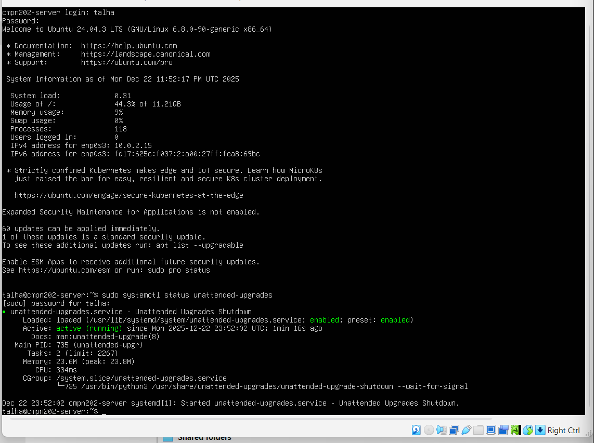
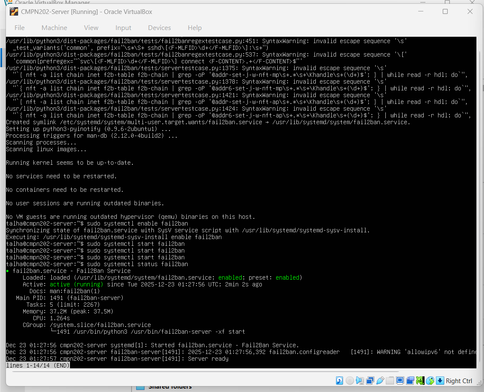

# 🛡️ Week 5 – Advanced Security Controls & Monitoring Infrastructure

---

## 1. Introduction

Week 5 focused on implementing **advanced operating system security controls** and building a basic verification/monitoring setup.  
These controls go beyond firewall protection and help prevent, detect, and report security issues.

All configuration tasks were performed **remotely via SSH from the workstation**, in line with the coursework administrative constraint.

---

## 2. Objectives for This Week

The objectives of Week 5 were:

- Implement mandatory access control using **AppArmor**
- Enable **automatic security updates**
- Configure intrusion prevention using **fail2ban**
- Create a **security baseline verification script**
- Run a **monitoring script** to collect system metrics
- Capture command-line evidence to validate the configuration

---

## 3. Mandatory Access Control (AppArmor)

AppArmor was used to enforce mandatory access control policies on the system.  
This reduces risk because even if an application is exploited, AppArmor can restrict what files and capabilities it can access.

### Command Used
- `sudo aa-status`

This command verifies that AppArmor is enabled and profiles are loaded/enforced.

---

## 4. Automatic Security Updates (unattended-upgrades)

Automatic updates were configured to ensure critical security patches can be applied without relying on manual intervention.  
This reduces the risk of known vulnerabilities remaining unpatched.

### Commands Used
- `sudo apt install unattended-upgrades`
- `sudo dpkg-reconfigure unattended-upgrades`

Verification was performed by checking the service status.

---

## 5. Intrusion Prevention with fail2ban

fail2ban was configured to help protect SSH by monitoring authentication logs and banning IP addresses that generate repeated failed logins.  
This reduces exposure to brute-force attacks.

### Command Used
- `sudo systemctl status fail2ban`

---

## 6. Security Baseline Verification Script (security-baseline.sh)

A verification script named `security-baseline.sh` was created and executed on the server.  
The purpose of this script is to quickly check whether key security controls are enabled and working.

### What the script verifies (high level)
- SSH service status
- Firewall status (UFW)
- AppArmor enabled
- fail2ban running
- unattended-upgrades running

The script was executed and the output was captured as evidence.

---

## 7. Monitoring Script Output (monitor-server.sh)

A basic monitoring script named `monitor-server.sh` was executed to collect system health metrics that support later performance analysis.

### Metrics collected include:
- System uptime / load
- Memory usage
- Disk usage

This provides a lightweight monitoring foundation for Week 6 performance testing.

---

## 8. Security vs Performance Trade-off

Advanced security controls can add small performance overhead (extra checks, logging, and background services).  
However, the trade-off is justified because the system gains stronger protection and better visibility, reducing the likelihood and impact of compromise.

---

## 9. Week 5 Requirement Checklist

| Requirement | Status |
|------------|--------|
| AppArmor enabled and verified | ✅ |
| Automatic updates configured and verified | ✅ |
| fail2ban configured and verified | ✅ |
| Security baseline script created and executed | ✅ |
| Monitoring script executed (evidence) | ⬜ |
| SSH-only administration | ✅ |

---

## 10. Reflection

Week 5 demonstrated how layered security improves operating system protection.  
By combining mandatory access control (AppArmor), automatic updates, intrusion prevention (fail2ban), and verification scripting, the server became more resilient to common attack vectors such as brute-force SSH attempts and unpatched vulnerabilities.

This week also built a practical foundation for performance monitoring, supporting the testing and optimisation work in Week 6.

---

### 🔗 Navigation
[Back to Index](INDEX.md) | [Week 1](Week1.md) | [Week 2](Week2.md) | [Week 3](Week3.md) | [Week 4](Week4.md) | Week 5 | [Week 6](Week6.md) | [Week 7](Week7.md)
