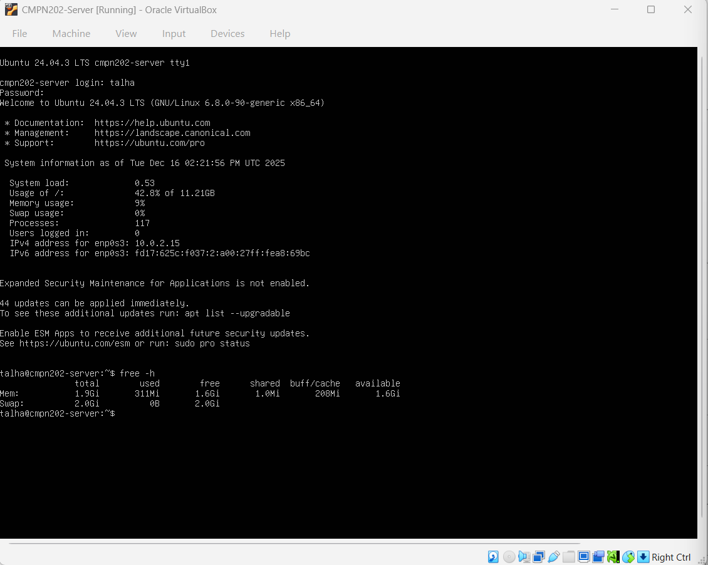
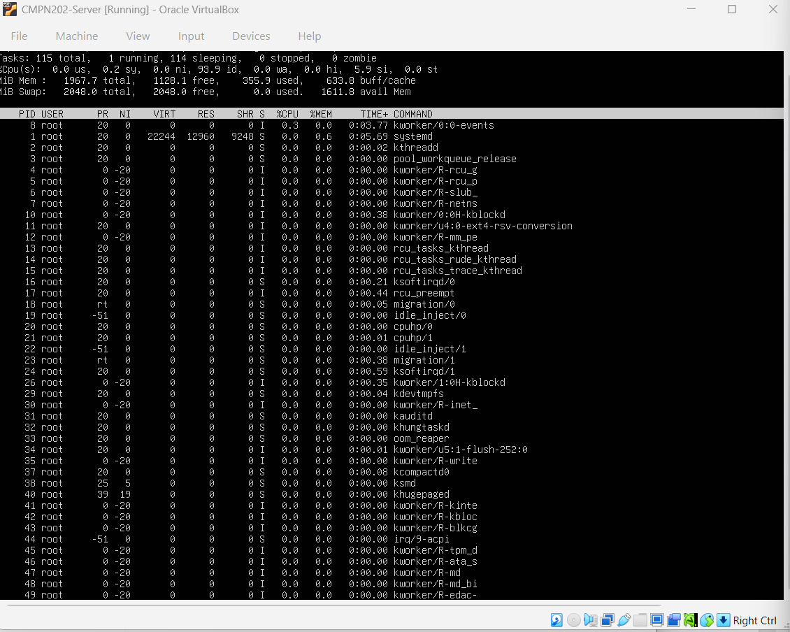
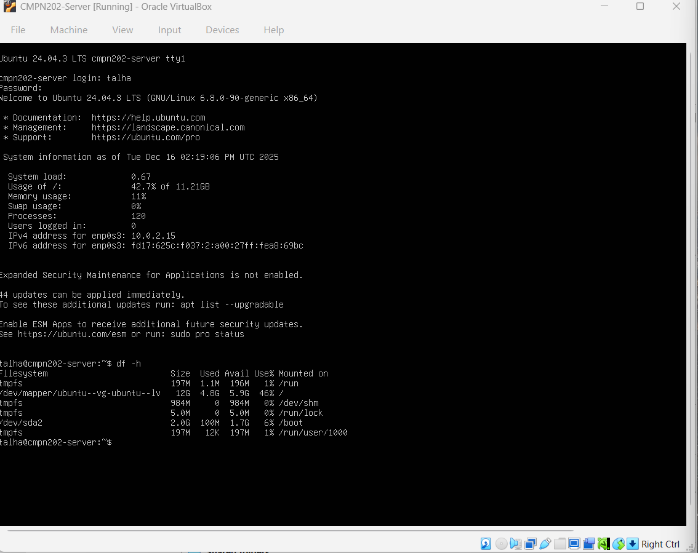

# 📈 Week 6 – Performance Monitoring, Stress Testing & System Analysis

---

## 1. Introduction

Week 6 focused on **evaluating operating system performance** under both idle and stressed conditions.  
Rather than only observing raw statistics, this week emphasised **interpretation, comparison, and analysis** of how system resources behave when workload intensity changes.

Performance monitoring is critical for identifying bottlenecks, ensuring system stability, and supporting informed optimisation decisions.  
This week builds on earlier system configuration and security hardening by analysing **real-world operating system behaviour** under load.

---

## 2. Objectives

The objectives of this week were to:

- Establish a baseline performance state
- Monitor CPU behaviour during idle and stressed conditions
- Analyse memory usage and allocation patterns
- Evaluate disk I/O behaviour
- Test basic network latency and reliability
- Identify performance bottlenecks
- Consider optimisation strategies

---

## 3. Performance Evaluation Methodology

A structured testing methodology was followed to ensure consistent and meaningful results:

Baseline measurement (idle system)  
↓  
Apply controlled workload  
↓  
Monitor system metrics  
↓  
Capture command-line output  
↓  
Analyse and compare results  

This approach ensures that any performance changes observed are **directly linked to the applied workload**, rather than background system activity.

---

## 4. System Uptime and Baseline State

Before stress testing, system uptime was checked to confirm stable operation.

The output confirms:
- The system was running continuously
- No unexpected restarts occurred
- Load averages were low

This establishes a reliable **baseline state** for further performance testing.

---

## 5. CPU Performance – Idle State

CPU usage was monitored while the system was idle using the `top` command.

### Analysis:
- CPU utilisation remained very low
- Most CPU time was spent in the idle state
- No background processes consumed excessive resources

This indicates efficient CPU scheduling and low overhead when no workload is applied.

---

## 6. Stress Tool Installation

The `stress` utility was installed to simulate controlled CPU and memory workloads.

Using a dedicated stress tool allows realistic workload testing without risking system damage.

---

## 7. CPU Performance – Under Load

A CPU stress test was performed to observe behaviour under high computational demand.

### Analysis:
- CPU utilisation increased significantly
- Load averages rose proportionally
- The system remained responsive

This demonstrates that the operating system can effectively manage CPU scheduling under heavy load without instability.

---

## 8. Memory Usage Analysis

Memory usage was monitored during both idle and stressed conditions.

### Idle memory usage:

### Memory usage under load:

### Analysis:
- Memory consumption increased during stress testing
- No memory exhaustion occurred
- Swap usage remained minimal

This shows that the operating system handled memory allocation efficiently under load.

---

## 9. Disk I/O Performance

Disk performance was analysed by comparing idle and write-intensive activity.

### Disk idle state:

### Disk under load:

### Analysis:
- Disk activity increased significantly during write operations
- I/O wait time became noticeable
- Disk operations had the greatest impact on overall system performance

Disk I/O was identified as the **primary performance bottleneck**.

---

## 10. Network Performance Testing

Network latency and reliability were tested using the `ping` command.

### Results:
- Stable connectivity was maintained
- Minor latency variation was observed
- No packet loss occurred

This confirms reliable network performance during system load.

---

## 11. Performance Comparison Summary

| Resource | Idle State | Under Load |
|--------|-----------|-----------|
| CPU | Very low utilisation | High utilisation |
| Memory | Stable | Increased usage |
| Disk | Minimal activity | Heavy I/O |
| Network | Stable | Slight latency |

This comparison highlights how different system components respond to workload pressure.

---

## 12. Bottleneck Identification

Based on the collected evidence:
- **Disk I/O** showed the greatest performance impact
- CPU and memory handled stress effectively
- Network performance remained stable

Identifying bottlenecks is essential for optimisation planning and capacity management.

---

## 13. Optimisation Considerations

Potential optimisation strategies include:
- Using faster storage (e.g. SSD)
- Improving disk caching strategies
- Scheduling intensive disk tasks during off-peak periods
- Ongoing performance monitoring

These approaches improve efficiency and reliability in production environments.

---

## 14. Learning Outcomes

This week improved understanding of:
- Performance monitoring tools
- Stress testing techniques
- Resource utilisation patterns
- Bottleneck identification
- Data-driven optimisation planning

---

## 15. Reflection

Week 6 demonstrated that system performance is influenced by how resources are managed under load, not just hardware capability.  
By combining monitoring tools with structured analysis, deeper insight into operating system behaviour was achieved.

This week reinforced the importance of **proactive performance evaluation** for maintaining stable, efficient systems.

---

### 🔗 Navigation
[Back to Index](index.md) | [Week 1](Week1.md) | [Week 2](Week2.md) | [Week 3](Week3.md) | [Week 4](Week4.md) | [Week 5](Week5.md) | Week 6 | [Week 7](Week7.md)
