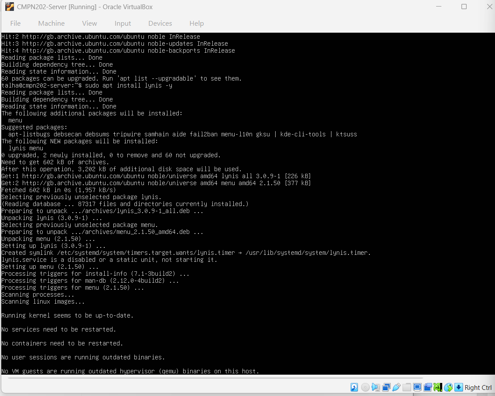
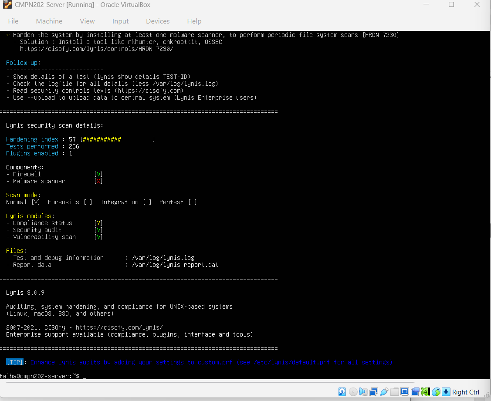
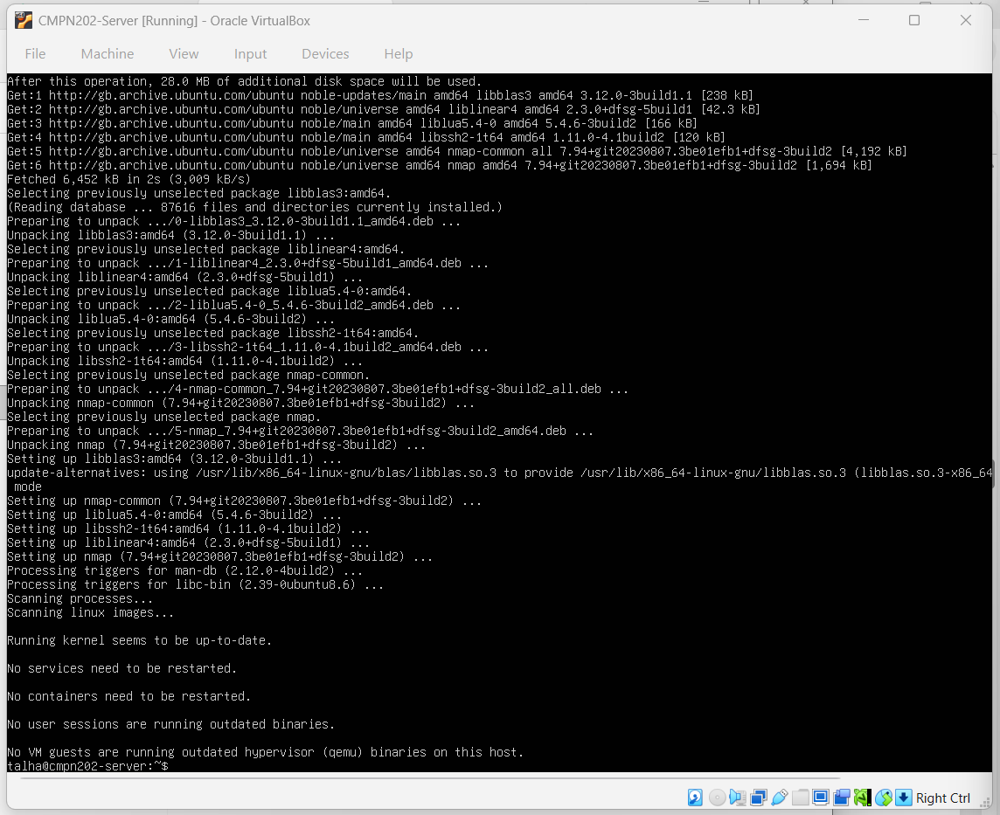
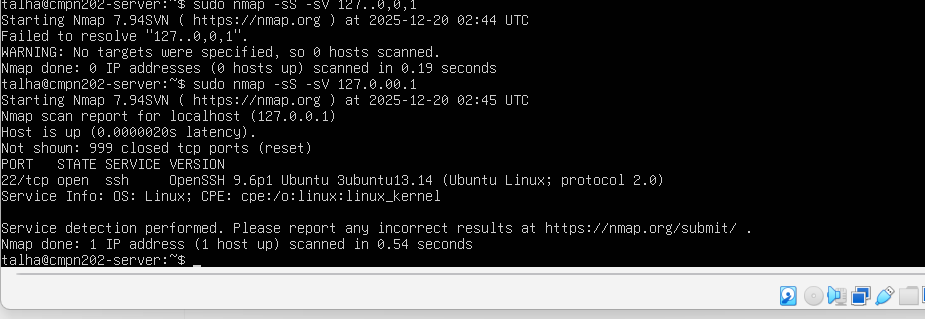

# 🔍 Week 7 – Security Audit & Final System Evaluation

---

## 1. Introduction

Week 7 focused on performing a **comprehensive security audit** and conducting a **final system evaluation** of the Linux server environment.  
The purpose of this phase was to validate that all configurations implemented throughout the coursework collectively provide a secure, stable, and well-managed operating system.

Rather than introducing new configurations, this week concentrated on **verification, assessment, and reflection**, which are essential practices in real-world system administration and security management.

---

## 2. Objectives for This Week

The objectives of Week 7 were to:

- Conduct a structured system security audit
- Identify vulnerabilities and configuration weaknesses
- Verify firewall rules and exposed network services
- Review running services and access control mechanisms
- Evaluate overall system readiness and resilience
- Reflect on learning outcomes and future improvements

---

## 3. Security Auditing Overview

A security audit evaluates whether a system’s configuration aligns with security best practices and operational requirements.

Key audit questions addressed:
- Are only required services running?
- Is network exposure minimised?
- Are access controls correctly enforced?
- Do existing security controls work as intended?

Security auditing ensures that controls are not only configured, but also **effective**.

---

## 4. System Audit Using Lynis

Lynis was used as the primary auditing tool to assess overall system security.

### Purpose of Lynis
- Analyse system configuration and permissions
- Detect security weaknesses and misconfigurations
- Provide hardening recommendations
- Generate a measurable hardening score

### Lynis Installation Evidence

This confirms that Lynis was successfully installed using the system package manager.

---

### Lynis Scan Summary

The scan summary provides:
- A system hardening index
- The number of tests performed
- Active security controls
- Identified improvement areas

The results confirm that key security mechanisms such as firewall enforcement and access control are active, while also highlighting areas for future optimisation.

---

## 5. Network Security Assessment Using Nmap

To validate firewall effectiveness and confirm minimal exposure, network scanning was performed using Nmap.

### Purpose of Nmap
- Identify open ports
- Detect exposed services
- Verify firewall rules
- Confirm attack surface reduction

---

### Nmap Installation Evidence

This confirms that Nmap was successfully installed and ready for network assessment.

---

### Nmap Scan Results

The scan results show that:
- Only **port 22 (SSH)** is open
- No unnecessary services are exposed
- Firewall rules are operating correctly

This confirms effective network hardening and controlled service exposure.

---

## 6. Service Review and Justification

Running services were reviewed to ensure that each service was required and justified.

Evaluation criteria:
- Is the service essential for system operation?
- Does it increase the attack surface?
- Can it be disabled without impacting functionality?

Only essential services such as SSH were retained, significantly reducing the system’s attack surface.

---

## 7. Access Control Verification

Access control mechanisms were reviewed to confirm:

- Use of non-root user accounts
- Controlled administrative access using `sudo`
- Proper group-based permission management

These checks confirm enforcement of the **principle of least privilege**, reducing the risk of accidental or malicious system changes.

---

## 8. Final Security Evaluation Summary

The table below summarises the overall security posture of the system:

| Security Area | Status |
|--------------|--------|
| SSH configuration | Secure |
| Firewall rules | Effective |
| Intrusion prevention | Enabled |
| Automatic updates | Configured |
| Access control | Restricted |
| Monitoring | Active |

Overall, the system demonstrates a **layered defence model** combining prevention, detection, and verification controls.

---

## 9. Strengths and Limitations

### Strengths
- Minimal exposed services
- Effective firewall enforcement
- Automated security auditing
- Stable and consistent configuration
- Clear separation of user privileges

### Limitations
- Monitoring could be extended with alerting mechanisms
- Performance testing could be expanded under additional workloads
- Hardware resources limit scalability

These limitations represent opportunities for future enhancement rather than critical weaknesses.

---

## 10. Key Learning Outcomes

By completing this coursework and the final audit phase, the following skills were developed:

- Performing structured security audits
- Interpreting vulnerability and hardening reports
- Validating firewall and network security controls
- Reviewing system services and access control
- Applying professional system administration practices

---

## 11. Final Reflection

Week 7 concluded the coursework by bringing together **security, performance, monitoring, and access control** concepts.  
The auditing process reinforced the importance of continuous evaluation and demonstrated how layered security controls work together to protect an operating system.

This final evaluation reflects real-world system administration practices, where validation and review are just as important as initial configuration and deployment.

---

### 🔗 Navigation
[Back to Index](INDEX.md) | [Week 1](Week1.md) | [Week 2](Week2.md) | [Week 3](Week3.md) | [Week 4](Week4.md) | [Week 5](Week5.md) | [Week 6](Week6.md) | Week 7
